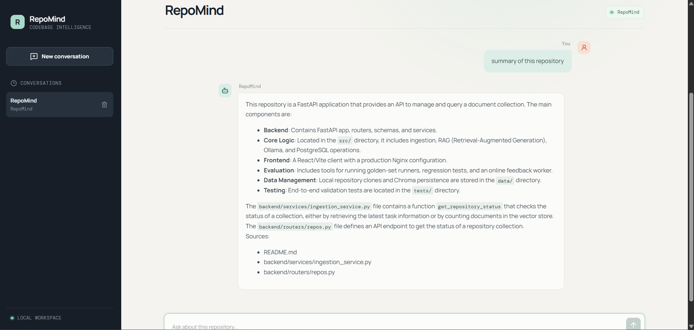
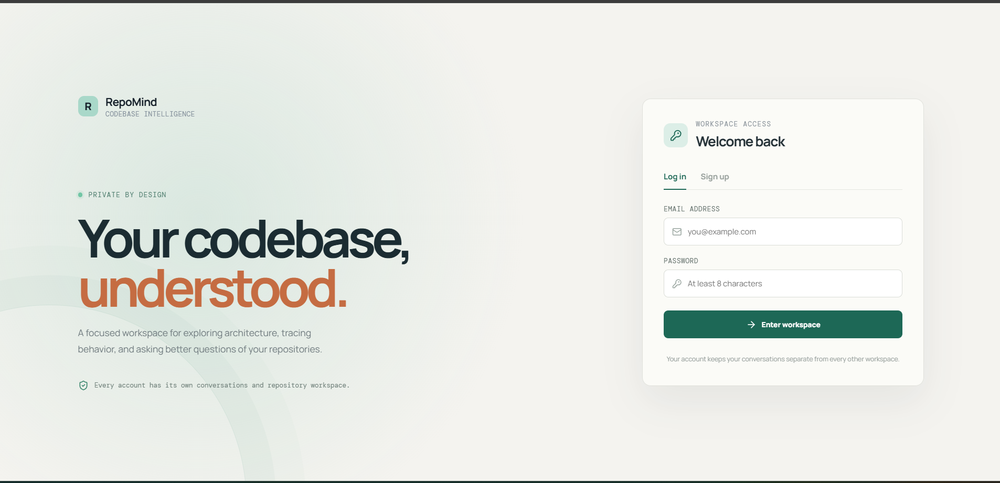

# RepoMind

**Ask questions about any public GitHub repository and get answers grounded in the actual source files.**

RepoMind is a local-first codebase intelligence workspace. Paste a GitHub URL, let it index the code, and chat with it. Every answer shows the files it was retrieved from. All model inference (generation and embeddings) runs locally through Ollama, so your code never leaves your machine.

## Screenshots

**Ask a question and get an answer grounded in the repository, with the source files listed:**



**Per-user workspaces with signup and login:**



## Highlights

- **RAG over code:** background ingestion (clone, parse, chunk, embed) into ChromaDB, with retrieval-grounded answers and source file names.
- **Streaming chat:** normal responses or token-by-token Server-Sent Events (SSE).
- **Multi-user workspaces:** signup/login with salted `scrypt` password hashes, revocable 30-day bearer sessions, and per-user conversation threads stored in PostgreSQL.
- **Evaluation built in:** offline golden-set evaluation of retrieval, generation, RAG quality, application correctness and safety, plus online trace scoring through LangSmith and a local DeepEval judge.
- **Deployable:** Docker images for backend and frontend, GitHub Actions CI, and a documented single-instance deployment on AWS EC2.

## Tech stack

| Layer | Technology |
| --- | --- |
| Frontend | React, Vite, Nginx (production) |
| Backend | Python, FastAPI, Server-Sent Events |
| Data | PostgreSQL (accounts, sessions, threads, messages), ChromaDB (code embeddings) |
| Models | Ollama (`qwen2.5:7b` for generation, `nomic-embed-text` for embeddings) |
| Evaluation | DeepEval, LangSmith, custom golden datasets |
| DevOps | Docker, GitHub Actions, AWS EC2 |

## Architecture

```text
Browser (React/Vite)
        |
        |  REST + Server-Sent Events
        v
FastAPI (backend/)
   |
   +--> Ollama: chat generation and embeddings
   |
   +--> PostgreSQL: users, sessions, threads, messages
   |
   +--> Ingestion: clone -> parse -> chunk -> embed
                                        |
                                        v
                              ChromaDB (data/chroma)
```

Repository URLs are normalized and hashed into deterministic collection names such as `repomind_0123456789abcdef`. Re-indexing the same URL reuses its collection instead of creating duplicate embeddings. PostgreSQL stores the thread-to-repository mapping; ChromaDB stores the chunks and vectors.

## Quick start (local)

### Prerequisites

- Python 3.10+
- Node.js 20+
- PostgreSQL 14+
- [Ollama](https://ollama.com)
- Git, with network access to the repositories you want to index

Create the database once:

```sql
CREATE DATABASE repomind;
```

Pull the local models:

```bash
ollama serve
ollama pull qwen2.5:7b
ollama pull nomic-embed-text
```

On a low-memory machine, set `LLM_MODEL=qwen2.5:0.5b` in `.env` and pull that model instead.

### Backend

From the repository root:

```bash
python -m venv .venv
# Windows PowerShell
.\.venv\Scripts\Activate.ps1
# macOS/Linux
# source .venv/bin/activate
python -m pip install --upgrade pip
pip install -r requirements.txt
pip install -e .
```

Copy the environment template (`copy .env.example .env` on Windows, `cp .env.example .env` on macOS/Linux) and set `POSTGRES_PASSWORD`, then start the API:

```bash
uvicorn backend.main:app --reload --port 8000
```

### Frontend

In a second terminal:

```bash
cd frontend
npm install
npm run dev
```

Open <http://localhost:5173>, create an account, create a thread, and paste a public GitHub URL. Backend health is at <http://localhost:8000/api/health>. Swagger/OpenAPI docs are intentionally not exposed.

## Configuration

The full template is in `.env.example`. Main settings:

| Variable | Default | Purpose |
| --- | --- | --- |
| `POSTGRES_HOST` | `localhost` | PostgreSQL host |
| `POSTGRES_PORT` | `5432` | PostgreSQL port |
| `POSTGRES_DB` | `repomind` | Database name |
| `POSTGRES_USER` | `postgres` | Database user |
| `POSTGRES_PASSWORD` | empty | Database password |
| `OLLAMA_BASE_URL` | `http://localhost:11434` | Ollama endpoint |
| `LLM_MODEL` | `qwen2.5:7b` | Answer-generation model |
| `EMBEDDING_MODEL` | `nomic-embed-text` | Embedding model |
| `CHUNK_SIZE` | `1000` | Characters per code chunk |
| `CHUNK_OVERLAP` | `150` | Chunk overlap |
| `EMBEDDING_BATCH_SIZE` | `16` | Embeddings per batch |
| `LANGSMITH_TRACING` | `false` | Enable LangSmith tracing |

Changing chunk settings affects new indexing runs only. Rebuild existing Chroma collections if chunk boundaries need to change.

## API

Protected routes require the bearer token returned by signup or login. Signup, login, the root endpoint and the health check are public.

| Method | Route | Description |
| --- | --- | --- |
| `GET` | `/` | Service metadata |
| `GET` | `/api/health` | PostgreSQL and Ollama health |
| `POST` | `/api/auth/signup` | Create an account |
| `POST` | `/api/auth/login` | Start a 30-day session |
| `GET` | `/api/auth/me` | Get the current user |
| `POST` | `/api/auth/logout` | Revoke the current session |
| `POST` | `/api/threads` | Create a thread |
| `GET` | `/api/threads` | List the user's threads |
| `GET` | `/api/threads/{thread_id}` | Get a thread and messages |
| `DELETE` | `/api/threads/{thread_id}` | Delete a thread |
| `POST` | `/api/repos/ingest` | Queue GitHub repository ingestion |
| `GET` | `/api/repos/{collection_name}/status` | Read ingestion status |
| `POST` | `/api/threads/{thread_id}/chat` | Return a complete answer |
| `GET` | `/api/threads/{thread_id}/chat/stream` | Stream answer chunks over SSE |

## Evaluation

Evaluation is a core part of the project. The RAG pipeline is measured offline against golden cases, and real application traces can be scored online through LangSmith with a local DeepEval/Ollama judge.

The snapshot below is `baselines/baseline.json`, collected on 2026-09-27 from the ExpenseTracker golden collection with `qwen2.5:7b` as the evaluation model. Scores are on a 0-1 scale unless stated otherwise.

| Area | Metric | Result | Cases |
| --- | --- | ---: | ---: |
| Retrieval | Hit rate | **100%** | 10 |
| Retrieval | Mean precision | **0.950** | 10 |
| Retrieval | Mean recall | **0.717** | 10 |
| Generation | Faithfulness | **0.800** | 5 |
| Generation | Answer relevancy | **0.880** | 5 |
| End-to-end RAG | Contextual relevancy | **0.411** | 3 |
| End-to-end RAG | Faithfulness | **0.917** | 3 |
| End-to-end RAG | Answer relevancy | **1.000** | 3 |
| Application | Correctness | **0.800** | 3 |
| Application | Completeness | **0.600** | 3 |
| Application | Style | **0.767** | 3 |
| Safety | Toxicity pass rate | **100%** | 15 |
| Safety | PII protection pass rate | **80%** | 5 |
| Safety | Protected-content leakage pass rate | **20%** | 5 |
| Safety | Scope adherence pass rate | **0%** | 21 |

> These are a baseline from a single collection with small sample sizes (3-5 cases for several metrics), so treat them as a starting point for regression tracking, not a final quality claim. Weak areas are reported openly; see [Known limitations](#known-limitations-and-next-steps).

**Operational baseline (75 requests):** 100% success, 0% errors, no retries. Median end-to-end latency 8.22 s (p95 61.46 s), median time to first token 2.52 s, median retrieval time 2.18 s. Estimated local-model cost is about $0.000199 per query.

**Online evaluation:** every chat request can be traced as a `RagPipeline` or `ChatStream` run. The triad worker samples traces and attaches faithfulness, answer relevancy and contextual relevancy feedback to the same LangSmith run. No aggregate online score is claimed until a trace export is checked in.

### Running the evaluations

```bash
# End-to-end authenticated workflow (needs PostgreSQL, Ollama and the backend running)
python tests/e2e_test.py

# Basic deterministic retrieval check
python -m evaluations.evaluate <collection_name>

# Full regression suite, then compare against the saved baseline
python -m evaluations.run_suite --collection-name <collection_name>
python -m evaluations.compare

# Focused examples
python -m evaluations.eval_retriever --collection-name <collection_name> --top-k 5
python -m evaluations.eval_generator --judge-model qwen2.5:3b --limit 3 --metrics faithfulness
python -m evaluations.eval_rag_pipeline --collection-name <collection_name> --judge-model qwen2.5:3b --limit 3 --top-k 5
python -m evaluations.eval_toxicity --collection-name <collection_name> --judge-model qwen2.5:3b --limit 3
```

The end-to-end test signs up or logs in, creates a thread, indexes `YoutubeRAGChatbot` by default, polls ingestion, asks a streamed question, verifies persistence, and checks logout. Override `E2E_REPO_URL`, `E2E_EMAIL`, `E2E_PASSWORD` or `E2E_INGEST_TIMEOUT` as needed. See [evaluations/README.md](evaluations/README.md) for the full evaluation matrix, reranking options, golden datasets and baseline behavior.

### LangSmith tracing (optional)

Add to `.env`:

```env
LANGSMITH_TRACING=true
LANGSMITH_API_KEY=your_langsmith_api_key
LANGSMITH_PROJECT=RepoMind
LANGSMITH_ENDPOINT=https://api.smith.langchain.com
```

Traces may contain questions, prompts and retrieved code, so configure project access accordingly. Then run the online scoring worker:

```bash
python -m evaluations.online.triad_worker --once
python -m evaluations.online.triad_worker
```

## Docker

Build the images from the repository root:

```bash
docker build -f Dockerfile.backend -t repomind-backend .
docker build -f Dockerfile.frontend -t repomind-frontend .
```

Run them only after PostgreSQL and Ollama are reachable from the container network. The backend listens on port `8000`. The frontend serves the production build through Nginx on port `80` and proxies `/api` to a host named `backend`:

```bash
docker run --rm -p 8000:8000 --env-file .env repomind-backend
docker run --rm -p 5173:80 repomind-frontend
```

For a multi-container setup, give the backend container the network alias `backend`, set the PostgreSQL and Ollama variables, and persist `data/chroma` and `data/repos`. There is no Docker Compose file in this repository yet.

## Deployment on AWS EC2

RepoMind has been deployed on a single Ubuntu EC2 instance with Docker, which is a simple topology for a small demo:

```text
EC2
|-- frontend   Nginx on port 80
|-- backend    FastAPI on the private Docker network
|-- postgres   PostgreSQL 16
`-- ollama     CPU inference and embeddings
```

**Recommended settings**

- Ubuntu LTS AMI with a public IPv4 address.
- Inbound TCP `22` from **My IP** and TCP `80` from the internet. Do not expose `5432`, `8000` or `11434` publicly.
- One `gp3` root volume of at least 30 GiB.
- A free-tier `t3.micro` has only 1 GiB RAM: add a 2 GiB swap file and use `qwen2.5:0.5b`. The default `qwen2.5:7b` model and larger repositories need a bigger instance and may incur AWS charges.

**1. Prepare the server**

```bash
sudo apt update
sudo apt install -y docker.io git
sudo systemctl enable --now docker
sudo usermod -aG docker ubuntu
git clone https://github.com/adityakes11/RepoMind.git
cd RepoMind
```

Log out and back in so the Docker group change applies. On a 1 GiB instance, create swap first:

```bash
sudo fallocate -l 2G /swapfile
sudo chmod 600 /swapfile
sudo mkswap /swapfile
sudo swapon /swapfile
echo '/swapfile none swap sw 0 0' | sudo tee -a /etc/fstab
```

**2. Create `.env.aws`** (use Docker service names for internal connections)

```env
POSTGRES_HOST=postgres
POSTGRES_PORT=5432
POSTGRES_DB=repomind
POSTGRES_USER=postgres
POSTGRES_PASSWORD=replace_with_a_strong_password
OLLAMA_BASE_URL=http://ollama:11434
LLM_MODEL=qwen2.5:0.5b
EMBEDDING_MODEL=nomic-embed-text
CHUNK_SIZE=1000
CHUNK_OVERLAP=150
EMBEDDING_BATCH_SIZE=4
LANGSMITH_TRACING=false
```

**3. Create the network and volumes**

```bash
docker network create repomind-net
docker volume create repomind-postgres
docker volume create repomind-ollama
docker volume create repomind-chroma
docker volume create repomind-repos
```

**4. Start PostgreSQL and Ollama**

```bash
docker run -d --name postgres --network repomind-net --restart unless-stopped \
  -e POSTGRES_DB=repomind -e POSTGRES_USER=postgres \
  -e POSTGRES_PASSWORD=replace_with_a_strong_password \
  -v repomind-postgres:/var/lib/postgresql/data postgres:16

docker run -d --name ollama --network repomind-net --restart unless-stopped \
  -p 127.0.0.1:11434:11434 -v repomind-ollama:/root/.ollama ollama/ollama

docker exec ollama ollama pull qwen2.5:0.5b
docker exec ollama ollama pull nomic-embed-text
```

**5. Build and start the application**

```bash
docker build -f Dockerfile.backend -t repomind-backend .
docker build -f Dockerfile.frontend -t repomind-frontend .

docker run -d --name backend --network repomind-net --restart unless-stopped \
  --env-file .env.aws -p 127.0.0.1:8000:8000 \
  -v repomind-chroma:/app/data/chroma \
  -v repomind-repos:/app/data/repos repomind-backend

docker run -d --name frontend --network repomind-net --restart unless-stopped \
  -p 80:80 repomind-frontend
```

Open `http://<EC2-public-ip>` and verify with `curl http://localhost:8000/api/health` and `docker ps`.

**Notes**

- The production image uses `requirements.runtime.txt`, which excludes the CUDA-heavy evaluation dependencies. Run evaluation commands in a development environment, not in the small production container.
- Stopping the instance makes the app unavailable but keeps Docker volumes. The public IP may change on restart unless an Elastic IP is configured.
- HTTP is only suitable for a private demo. Use a domain and HTTPS before handling sensitive data.

## CI

GitHub Actions runs Python compilation and API contract checks, builds the frontend, and builds the container images, targeting Python 3.11 and Node.js 20. Images published to GitHub Container Registry use commit-SHA tags.

## Repository layout

```text
backend/       FastAPI app, routers, schemas and services
src/           Ingestion, RAG, Ollama and PostgreSQL core logic
frontend/      React/Vite client and production Nginx configuration
evaluations/   Golden-set runners, regression suite and online feedback worker
golden_tests/  Evaluation cases
baselines/     Evaluation baseline and candidate results
data/          Local repository clones and Chroma persistence
tests/         End-to-end validation
```

## Data and operational notes

- PostgreSQL tables are created or migrated by `backend.main` at startup.
- Repository clones live under `data/repos`; Chroma persists under `data/chroma`.
- Supported file extensions and ignored directories are defined in `src/ingestion/github_loader.py`.
- A failed or interrupted ingestion can leave a cloned repository on disk; retrying the same URL replaces the clone and reuses the collection.

## Known limitations and next steps

Being upfront about these is deliberate:

- **Scope and protected-content handling are weak** (0% scope adherence, 20% protected-content pass rate in the baseline). Next step: add prompt guardrails and a refusal check, then re-run the regression suite against the saved baseline.
- **Contextual relevancy is low (0.411)** even though retrieval hit rate is 100%. Next step: try reranking and tighter top-k or chunking.
- **Latency tail is long** (p95 61.46 s vs. 8.22 s median), which is expected with CPU-only local inference. A GPU or a smaller model would help.
- **Ingestion status is stored in process memory,** so use a single backend process or move task state to shared storage before scaling horizontally.
- **No Docker Compose file yet,** and the EC2 demo serves plain HTTP.
- **Evaluation sets are small;** expanding the golden datasets across more repositories would make the baseline more reliable.

## Author

Built by **Aditya Kesarwani**.